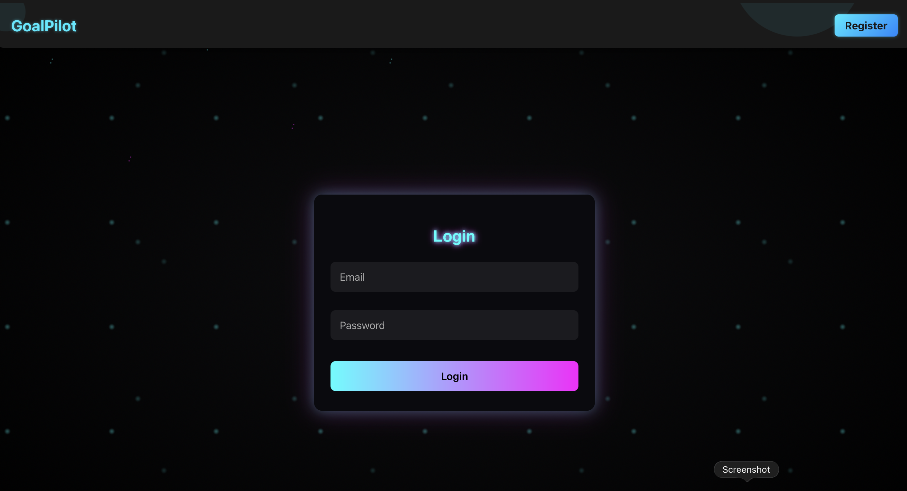
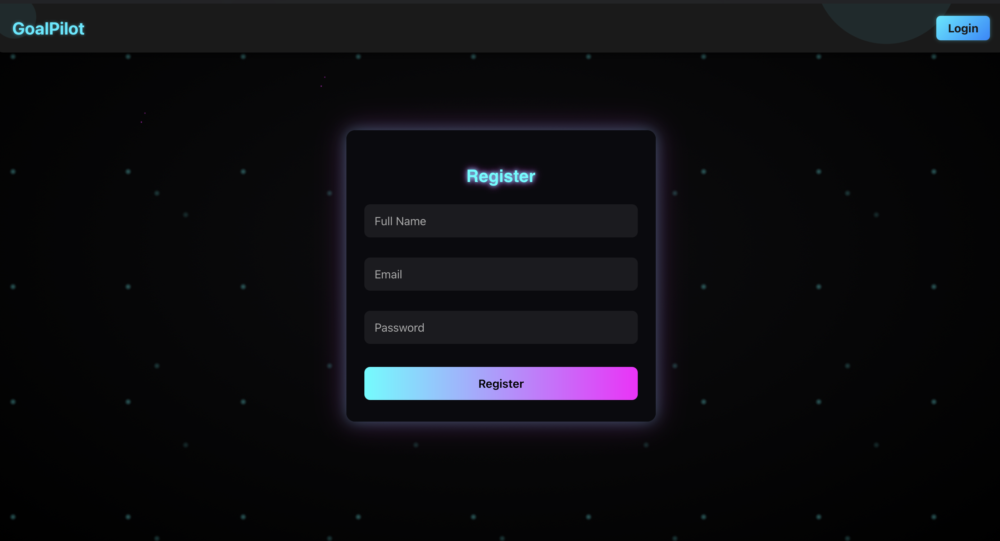

# GoalPilot – Full-Stack Learning Goal Tracker

GoalPilot is a full-stack web application built as part of the **ProU Technology – Track 3 (Full-Stack Development) Online Assessment**.  
It helps users set learning goals, track progress, and revise completed skills with a clean UI and database-backed API.

---

## 🚀 Live Demo : https://goalpilot-prou-frontend.onrender.com

Deployment :

Frontend - Render - https://goalpilot-prou-frontend.onrender.com  
Backend - Render - https://goalpilot-prou-backend.onrender.com 

---

**Screen Recording:** https://drive.google.com/file/d/1EHc8CPn5VA_bNqk83iDDHDH2Oa_oKPYG/view?usp=drive_link

---

## 📸 Screenshots




---

## 🛠️ Tech Stack

**Frontend:** React.js, HTML5, CSS3, JavaScript  
**Backend:** Node.js, Express.js  
**Database:** MongoDB Atlas  
**Deployment:** Render (Frontend + Backend)

---

## 📦 Setup Instructions (Local)

### 1. Clone the Repository
```bash
git clone https://github.com/Raviteja-37/GoalPilot-ProU
```

### 2. Backend Setup
```bash
cd goalpilot-backend
npm install
```

Create `.env` in backend:
```
MONGO_URI=your_mongodb_url
JWT_SECRET=your_secret
PORT=5001
YOUTUBE_API_KEY=your_yt_api_key
```

Start backend:
```bash
npm start
```

### 3. Frontend Setup
```bash
cd goalpilot-frontend
npm install
```

Create `.env` in frontend:
```
REACT_APP_BASE_URL=http://127.0.0.1:5001/api
```

Start frontend:
```bash
npm start
```

---

## 📘 Features
- User Registration & Login (JWT Authentication)  
- Add, update, and complete learning goals  
- Revision feature for completed skills through YT
- Dashboard with progress visualization (charts)  
- User-specific data stored in cloud database  
- Fully deployed frontend + backend

---

## ⭐ Bonus Features Implemented
- ✔ Deployment on Render  
- ✔ JWT Auth (Authentication) + Protected Routes
- ✔ Visual Charts for progress  
- ✔ Clean UI with intuitive UX  

---

## 📝 Assumptions
- Each user has a private set of goals  
- Dashboard shows completed vs in-progress counts  
- Session maintained using temporary JWT token  
